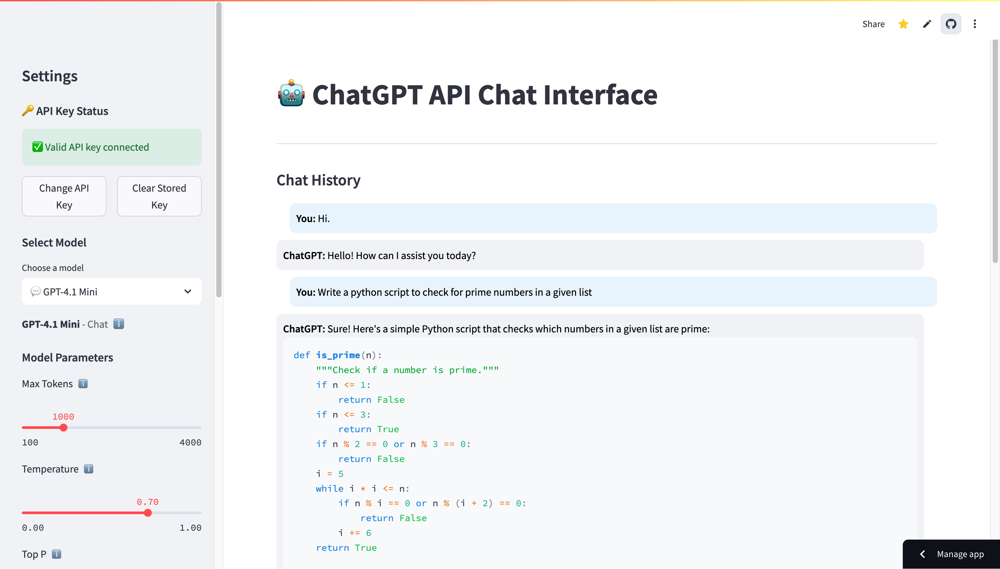

# OpenAI-API-Chat

This is just a simple web app to use the OpenAI models via API access. It also allows changing the parameters of the models. Of course, this can be done through the playground of OpenAI but I find the process tedious. I have shared some screenshots from the web app below. Please feel free to send feedback.

Web app: https://openai-api-chat.streamlit.app/

